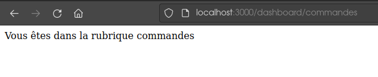

# Projet de réécriture du projet de fin de formation DevOps de python flask vers node javascript

##  Installation de node

Curl is used for downloading official Node.js installation script while build-essential is for compiling and installing native addon

```bash
sudo apt install curl build-essential
```

Add Nodesource Repository.

```bash
curl -sL https://deb.nodesource.com/setup_16.x | sudo -E bash -
```

After adding NodeSource repository, it is time to install Node.js. The command will also install NPM (Node Package Manager) which is a Javascript package manager.

```bash
sudo apt install -y nodejs
```

```bash
$ node -v
v16.17.0
```

```bash
$ npm -v
8.15.0
```

## Mise en route du projet

```bash
$ npm init
```

### Création du projet avec le framework express

```bash
$ npm install express --save
```

On crée un fichier app.js avec notre code et on lance le site avec la commande

```bash
node app.js
```
#### Info

On peut écrire une méthode ainsi

```node
app.get('/', function(req, res) {
    res.send('Hello Word!')
});
```
ou avec la synthaxe ecmascript 6

```node
app.get('/', (req, res) => {
    res.send('Hello Word!')
});
```
De même, au lieu de :

```node
const PORT = 3000;
app.listen(PORT, function() {
    console.log('listening on port ' + PORT);
});
```

On peut écrire :

```node
const PORT = 3000;
app.listen(PORT, function() {
    console.log(`listening on port ${PORT}`);
})
```

On appelle ceci les template strings ou aussi template literals. L'usage de base consiste à imbriquer des variables dans les chaînes, entre ${ et }. Elles se verront "remplacées" par leur valeur au moment de l'exécution.

### Relancer automatiquement le serveur node avec nodemon

On installe le paquet nodemon globalement

```bash
sudo npm install -g nodemon --save-dev
```

Pour qu'il soit pris en compte dans notre projet, on relance sans l'option -g

```bash
sudo npm install nodemon --save-dev
```

on le retrouve ainsi dans le fichier package.json

```json
{
  "name": "novationmenu",
  "version": "1.0.0",
  "description": "Menu digital pou restaurateurs",
  "main": "app.js",
  "scripts": {
    "test": "echo \"Error: no test specified\" && exit 1"
  },
  "author": "Richard CRUZ",
  "license": "ISC",
  "dependencies": {
    "express": "^4.18.1"
  },
  "devDependencies": {
    "nodemon": "^2.0.19"
  }
}
```

On lance l'application avec la commande :

```bash
nodemon app.js
```

```bash
$ nodemon app.js
[nodemon] 2.0.19
[nodemon] to restart at any time, enter `rs`
[nodemon] watching path(s): *.*
[nodemon] watching extensions: js,mjs,json
[nodemon] starting `node app.js`
listening on port 3000
```

Dès qu'il y a un changement, il redemarre le serveur mais il faut quand même recharger le navigateur.

Une bonne pratique est d'utiliser l'entrée script du fichier package.json et de créer une nouvelle propiété start comme suit :

```node
{
  "name": "novationmenu",
  "version": "1.0.0",
  "description": "Menu digital pou restaurateurs",
  "main": "app.js",
  "scripts": {
    "start": "node app.js",
    "test": "echo \"Error: no test specified\" && exit 1"
  },
  "author": "Richard CRUZ",
  "license": "ISC",
  "dependencies": {
    "express": "^4.18.1"
  },
  "devDependencies": {
    "nodemon": "^2.0.19"
  }
}
```

Pour lancer l'application, on fera donc un :

```bash
npm start
```

On peut aussi créer une entée dev comme suit :

```node
{
  "name": "novationmenu",
  "version": "1.0.0",
  "description": "Menu digital pou restaurateurs",
  "main": "app.js",
  "scripts": {
    "start": "node app.js",
    "dev": "nodemon app.js",
    "test": "echo \"Error: no test specified\" && exit 1"
  },
  "author": "Richard CRUZ",
  "license": "ISC",
  "dependencies": {
    "express": "^4.18.1"
  },
  "devDependencies": {
    "nodemon": "^2.0.19"
  }
}
```

Par contre, pour lancer dans ce mode, on procède avec la commande suivante :

```bash
npm run dev
```

npm start est un alias de npm run start. C'est aussi le cas pour npm test. Pour les commandes qu'on crée nous même, il ne faut pas oublier le run.


## Création de routes

```javascript
app.get('/dashboard', (req, res) => {
    res.send('Bientôt')
});


app.get('/', (req, res) => {
    res.send('Hello Richard!')
});
```

On a deux routes la route dashboard et la route "racine"

On peut créer des routes automatiquement :

```javascript
app.get('/dashboard/:id', (req, res) => {
    const id = req.params.id;
    res.send(`Vous êtes dans la rubrique ${id}`)
});
```

Ici, la page renvoit une phrase qui contient la donnée qu'on a mis après l'url http://localhost:3000/dashboard/

Ce qui donne :



Si on veut créer une route particulière du style http://localhost:3000/dashboard/add, il faut faire attention ou on place la route dans le code. Dans notre exemple, il faut la mettre avant la définition des routes dynamiques

```javascript
app.get('/dashboard/add', (req, res) => {
    res.send('Formulaire d\'ajout')
});

app.get('/dashboard/:id', (req, res) => {
    const id = req.params.id;
    res.send(`Vous êtes dans la rubrique ${id}`)
});
```
Si on intervertit ces deux blocs, le serveur va considerer que add est l'id et nous n'aurons pas le résultat escompté. il faut mettre les routes spécialisées avant les routes génériques.


## Les views engines

### Création d'un template avec EJS

Ejs est un template engine.

```bash
npm install ejs --save
```
Pour pouvoir l'utiliser, on va utiliser la methode set pour indiquer ou se trouve nos views. On crée un répertoire views.

Dans notre code, on rajoute les deux lignes suivantes :

```javascript
app.set('views', './views');
app.set('view engine', 'ejs');
```
La première ligne spécifie ou nous allons trouver les views et la seconde ligne indique à express quel moteur de view engine nous allons utiliser. Il existe d'autres view engine tels que Handlebars ou Jade...

On commence par créer un fichier index.ejs dans le dossier views. On y écrit le contenu qui est du html classique. Ensuite, il faut spécifier à express qu'on veut utiliser le template. pour cela, on utilise la méthode render et non plus send qui renvoit du texte brut ou du html.

```javascript
app.get('/', (req, res) => {
    res.render('index');
});
```

Si dans notre code, nous lui spécifions un schéma vers des fichiers css ou javascript, ils ne seront pas pris en compte car ce sont des fichiers statiques. Il faut les mettre à disposition via un middleware.
On a un middleware dedié aux fichiers statiques.

```javascript
app.use('/assets',express.static('assets'));
```

### Passer des données à une vue

On sait passer des données grâce à ":"

```javascript
app.get('/dashboard/:id', (req, res) => {
    const id = req.params.id;
    res.send(`Vous êtes dans la rubrique ${id}`)
});
```
Dans id, on récupère la valeur passée dans :id

```javascript
app.get('/dashboard/:id', (req, res) => {
    const id = req.params.id;
    res.render('dashboard', {dashboardid: id});
});
```
On rajoute un deuxième paramètre à la méthode render. On passe un objet qui a pour propriété qu'on a appelé dashboardid et en valeur, on lui donne id qu'on a récuperé via req.params

Et dans la vue, on récupère la valeur avec la synthaxe suivante

```javascript
<%=  dashboardid %>
```

On peut passer plus de paramètres :

```javascript
app.get('/dashboard/:id', (req, res) => {
    const id = req.params.id;
    const title = "Monsieur";
    res.render('dashboard', {dashboardid: id, genre: title});
});
```

De la même façon, on récupère la valeur de title avec ce code dans la view dashbord.ejs :

```javascript
<%=  title %>
```
On peut aussi passer plusieurs paramètres avec la synthaxe suivante:

```javascript
app.get('/dashboard/:id/:title', (req, res) => {
    const id = req.params.id;
    const title = req.params.title;
    res.render('dashboard', {dashboardid: id, genre: title});
});
```

### Découper une vue

L'interêt est de réutiliser le code commun à toutes les pages du site comme les headers, les menus de navigation et le footer...

Pour cela, on crée un dossier partials dans views.

On crée un fichier header.ejs ou on copie le contenu de notre header commun à chaque page, on procède de la même manière avec le footer et dans toutes les pages de notre site, on appelle le header avec la synthaxe suivante :

```javascript
<%- include('partials/header.ejs') %>
```

On fait de même avec le footer

```javascript
<%- include('partials/footer.ejs') %>
```

### Comment itérer sur un tableau d'objet


